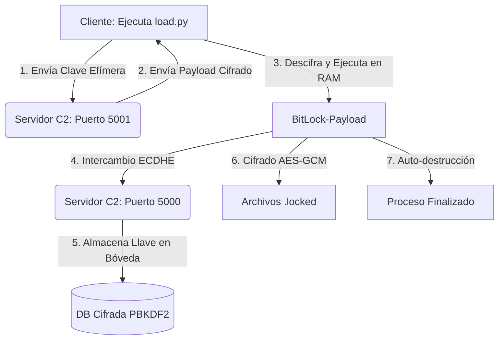

# 🛡️ BitLock Framework: Ecosistema de Criptovirología y C2 (PoC)

  

Este repositorio contiene una **Prueba de Concepto (PoC)** integral diseñada para el estudio de arquitecturas de amenazas modernas. El proyecto simula un entorno de ataque *fileless* (sin archivos) con una infraestructura de comando y control (C2) protegida por criptografía de curva elíptica y protocolos de borrado seguro.

---

## 🔬 Análisis del Ciclo de Vida del Ataque

El sistema opera mediante una ejecución coordinada de tres módulos principales, diseñados para evadir defensas tradicionales y garantizar la persistencia de las llaves en el servidor.

### 1. Infiltración Volátil (`load.py`)
El ataque inicia con un **Stager de Etapa 0**. Su función principal es la evasión de EDR (Endpoint Detection and Response):
* **Handshake Efímero:** Genera una clave AES-256 única en RAM y la transmite al puerto `5001`.
* **Cifrado de Carga Útil:** El servidor cifra el ransomware en tiempo real antes del envío, frustrando la inspección de paquetes por firmas estáticas.
* **Ejecución In-Memory:** El payload se descifra y compila a *bytecode* directamente en la memoria volátil.
* **Anti-Forense:** Implementa un `secure_wipe` para destruir la clave y el código fuente en texto plano antes de invocar `exec()`.

### 2. Establecimiento de Canal C2 (`BitLockC2Server.py`)
El servidor funciona como una bóveda blindada para la gestión de activos criptográficos:
* **Hardening de Bóveda:** La base de datos de llaves utiliza cifrado **AES-256-GCM** con derivación **PBKDF2** (480,000 iteraciones).
* **Seguridad Física:** El comando `--del` activa un algoritmo de **trituración de datos** (data shredding) que sobrescribe los archivos con basura aleatoria y utiliza `os.fsync()` para asegurar el vaciado del búfer de hardware.

### 3. Motor de Cifrado del Objetivo (`BitLock-payload.py`)
El módulo inyectado ejecuta el cifrado de archivos con estándares militares:
* **Handshake Híbrido:** Implementa **ECDHE (Curva P-384)** para lograr *Perfect Forward Secrecy* (PFS). Posee un fallback automático a **RSA-4096** si las librerías de curvas elípticas no están presentes.
* **Cifrado Autenticado:** Utiliza AES-GCM para garantizar que los archivos no puedan ser alterados ni recuperados sin la firma de integridad original.
* **Evasión Inteligente:** Omite directorios críticos del sistema (`Windows`, `/bin/`, `/etc/`) para evitar el colapso del sistema operativo y asegurar la visibilidad del reporte de resultados.

---

## 📊 Diagrama de Flujo (Data Pipeline)

---

## ⚙️ Especificaciones Técnicas de Seguridad

| Módulo | Tecnología | Propósito Forense |
| --- | --- | --- |
| **Intercambio** | ECDHE (P-384) | Evitar recuperación de llaves vía sniffing de red. |
| **Derivación** | HKDF (SHA-256) | Generar llaves simétricas a partir de secretos compartidos. |
| **Cifrado** | AES-256-GCM | Garantizar confidencialidad e integridad de los datos. |
| **Protección DB** | PBKDF2 (480k iter.) | Máxima resistencia contra ataques de fuerza bruta offline. |
| **Borrado** | 7-Pass Overwrite | Neutralizar herramientas de recuperación forense (FTK/EnCase). |

---

## ⚠️ Descargo de Responsabilidad (Ethical Hacking)

**Este proyecto es estrictamente para fines educativos y de investigación.**

1. El uso de esta herramienta en sistemas sin autorización previa es **ilegal** y constituye un delito informático.
2. El autor **no se hace responsable** por daños a la infraestructura del usuario o de terceros.
3. Si el usuario bloquea su propio sistema debido a un error de configuración, asume total responsabilidad técnica y económica de la recuperación de sus datos.

---

**Desarrollado para la investigación de seguridad ofensiva y defensa de infraestructuras críticas.**
